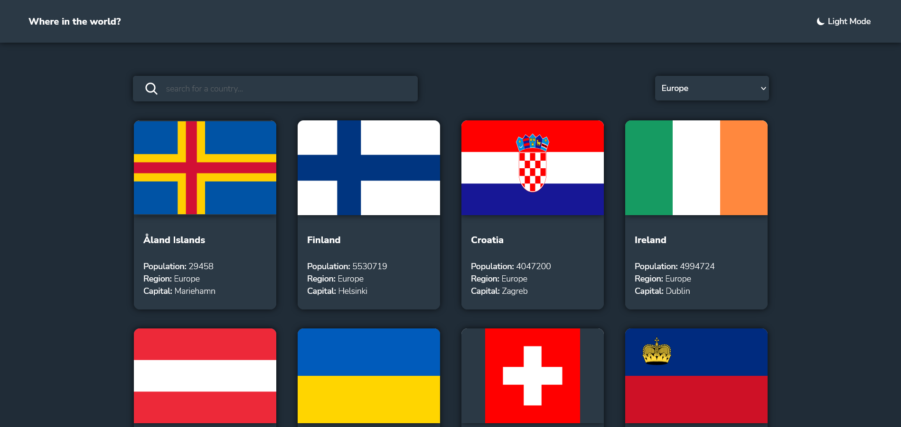

# Frontend Mentor - REST Countries API with color theme switcher solution

This is a solution to the [REST Countries API with color theme switcher challenge on Frontend Mentor](https://www.frontendmentor.io/challenges/rest-countries-api-with-color-theme-switcher-5cacc469fec04111f7b848ca). 

## Table of contents

- [Overview](#overview)
  - [The challenge](#the-challenge)
  - [Screenshot](#screenshot)
  - [Links](#links)
- [My process](#my-process)
  - [Built with](#built-with)
  - [What I learned](#what-i-learned)
  - [Continued development](#continued-development)
  - [Useful resources](#useful-resources)
- [Author](#author)
- [Acknowledgments](#acknowledgments)

## Overview

### The challenge

Users should be able to:

- See all countries from the API on the homepage
- Search for a country using an `input` field
- Filter countries by region
- Click on a country to see more detailed information on a separate page
- Click through to the border countries on the detail page
- Toggle the color scheme between light and dark mode *(optional)*

### Screenshot

### Links

- Solution URL: (https://github.com/Darionas/rest-countries-api-with-color-theme-switcher)
- Live Site URL: (https://darionas.github.io/rest-countries-api-with-color-theme-switcher/)

## My process

* Set HTML layout:
* Create CSS external file to set style for HTML layout:
  * To achieve responsive web design:
     * implement grid layout module;
     * Create first for mobile;
     * Later for desktop;
     * Use media query;
* Implement javaScript:
     * Use fetch technique to implement countires data from rest countries

### Built with

- Semantic HTML5 markup
- CSS custom properties
    - CSS Grid
    - Mobile-first workflow
    - Media query
- JavaScript

But created with love.

### What I learned

- enabling async, arrow functions, template literals in ES8 dialogflow
- generate and implement favicons for all browsers;
- set css properties for input placeholder;
- implement service worker;
- implement light & dark mode;
- fetch data from data source;
- use template literals;

### Continued development

- Grid layout module.
- JavaScript.
- Practise dealing with Git & GitHub.
- Practise creating navigation for mobile layout.
- Implement JSON data to html (next project).

### Useful resources

- [jshint esversion: 8](https://groups.google.com/g/dialogflow-essentials-edition-users/c/eDwP7ZV5FyQ) - It's enable async, array functions, template literals in ES8 dialogflow. Version esversion can be set by dev.
- [It is tool which let's generate and implement favicons for all browsers](https://realfavicongenerator.net/) - It helps to generate favicons for all browsers.
- [Implement service worker, fetch data from REST Countries API](https://stackoverflow.com/questions/30117939/how-to-change-the-colour-of-placeholder-using-javascript#30117998) - It is example how need to fetch data from REST Countries API.
- [Implement light & dark mode](https://css-tricks.com/a-complete-guide-to-dark-mode-on-the-web/) - Here provide guides how to create light & dark mode in different ways.

## Author

- Frontend Mentor - [@Darionas](https://www.frontendmentor.io/profile/Darionas)

## Acknowledgments

- Thank you Frontend Mentor team for opportunity to try, practice, train yourself in different level challenges and gain invaluable experience.
- Thank you @Vikram from Frontend Mentor for guidance.
